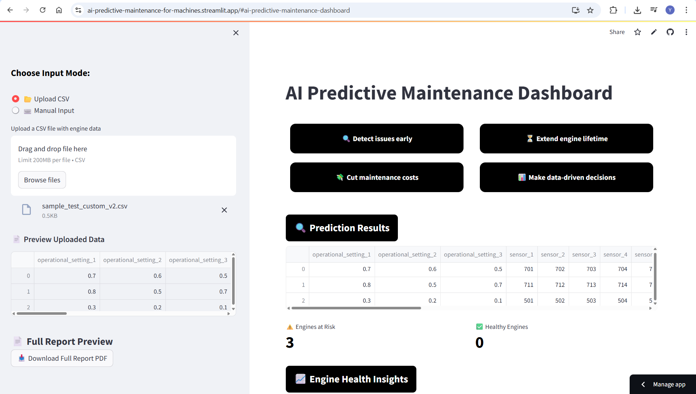

# AI Predictive Maintenance

## 📝 Project Overview
Unexpected failures in energy infrastructure components like **turbines, transformers, and solar panels** lead to **loss of energy and high maintenance costs**.  
This project applies **AI and Machine Learning** techniques to predict **Remaining Useful Life (RUL)** of engines, helping to schedule **predictive maintenance** before failures occur. By doing so, it supports more reliable and **sustainable energy** production while minimizing environmental impact. 

**Problem Statement:**  
- Predict how many operational cycles remain before an engine fails.  
- The data is multivariate time series from multiple engines (fleet data).  
- Each engine starts with unknown initial wear; faults develop over time.  
- Training data runs engines until failure; test data stops before failure.  

**Proposed Solution:**  
- Train ML models (baseline and deep learning) on sensor and operational data.  
- Use time-series modeling to predict RUL for each engine.  
- Output alerts like: “Engine X likely to fail”.  
- Helps reduce downtime and maintenance costs.

---

## 🚀 Dashboard Preview



---

## 📊 Dataset
This project uses the **NASA Turbofan Jet Engine Data Set** for building machine learning models to predict the **Remaining Useful Life (RUL)** of engines. 
- **Dataset:** - [Kaggle CMAPSS Dataset](https://www.kaggle.com/datasets/behrad3d/nasa-cmaps)
- The dataset consists of four subsets: **FD001, FD002, FD003, FD004**.
- Data contains **sensor readings**, operational settings, and engine lifecycle.

---

## 📂 Folder Structure
```

 ai_predictive_maintenance/
├── app.py # for dashboard 
├── data/ 
│ ├── raw/ # Original CMAPSS dataset files (train, test, RUL)
│ └── processed/ # Cleaned CSVs with RUL column added
│
├── notebooks/ 
│ ├── 01_data_preprocessing.ipynb #  Load, clean, RUL, EDA
│ ├── 02_baseline_models.ipynb #  ML baseline models (LGBM, XGBoost, Random forest)
│ ├── random_forest_pipeline.ipynb #  Random forest model
│ ├── deep_learning_comparison.ipynb #  LSTM/TCN models
│
├── utils/ 
│ ├── data_pipeline.py # Functions to load & clean data
│ ├── feature_engineering.py # Feature extraction functions
│ └── visualization.py # Plotting utilities
│
├── outputs/ 
│ ├── models/ # Trained models (.pkl, .pt)
│ └── figures/ # Plots and charts
│
└── README.md # Project documentation

```

---


---

## Steps Completed

✔️ **Data Preprocessing & Feature Engineering**
- Loaded all **FD001–FD004** CMAPSS datasets.  
- Added **Remaining Useful Life (RUL)** for each unit.  
- Created **binary near-failure label** (`1 if RUL ≤ 30 else 0`).  
- Saved clean processed data for modeling.  

✔️ **Exploratory Data Analysis**
- Visualized RUL distributions.  
- Plotted sample sensor signals to observe degradation patterns.  

✔️ **Baseline ML Models**
- Implemented and compared **Random Forest, XGBoost, and LightGBM**.  
- Reason: These **tree-based models** are strong baselines for tabular sensor data.  

✔️ **Deep Learning Models**
- Implemented **LSTM** (sequence learning) and **TCN** (temporal convolutions).  
- Reason: To test if **temporal dependencies** improve prediction accuracy compared to ML baselines.  

✔️ **Model Comparison & Selection**
- Evaluated models on **Accuracy, Precision, Recall, and F1 score**.  
- Random Forest consistently provided **best balance of metrics** across datasets.  

---

## 🏆 Model Selection

After evaluating on **FD001–FD004**, Random Forest emerged as the **best overall model**.  
Below is a simplified comparison summary:

| Model          | Accuracy | Precision | Recall | F1 Score | Notes |
|----------------|----------|-----------|--------|----------|-------|
| **Random Forest** | ✅ Highest & stable | ✅ High | ✅ Balanced | ✅ Best overall | **Selected** |
| XGBoost        | High     | High      | Slightly lower | Good | Close, but less consistent |
| LightGBM       | High     | Moderate  | Moderate | Good | Similar to XGBoost |
| LSTM           | Moderate | Good      | Lower   | Lower | Slower, heavy training |
| TCN            | Moderate | Good      | Lower   | Lower | Similar to LSTM |

👉 **Final Choice:** **Random Forest Classifier**  
- Reliable performance across all datasets.  
- Computationally efficient and interpretable.  
- Outperformed or matched deep learning models in this case.  

---

## Final Steps
- Extend from **classification** to **regression RUL prediction**.  
- Hyperparameter optimization for Random Forest.  
- Build an **interactive dashboard** to monitor engine health using **streamlit**.  
- Deploy trained model in an **end-to-end pipeline**.  

---

## 🚀 Quick Start
1. **Clone the repository:** - git clone https://github.com/Yamuna23071A6730/ai-predictive-maintenance.git
2. **Create a virtual environment and install dependencies:** -
   python -m venv venv
   source venv/bin/activate  # On Windows: venv\Scripts\activate
   pip install -r requirements.txt
3. **Run the Streamlit dashboard:** - streamlit run app.py


---

## Author
**Yamuna L**  
Engineering Student specializing in Data Science  
(Work done as part of AI Predictive Maintenance project challenge for Edunet AICTE shell Internship)


